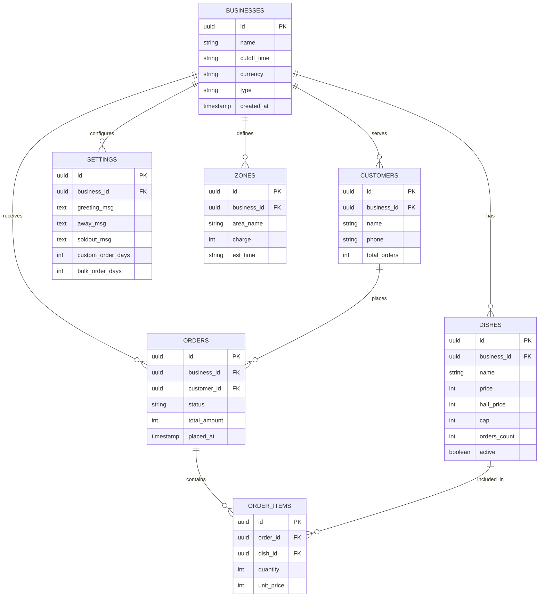

```mermaid
erDiagram
    BUSINESSES ||--o{ DISHES : has
    BUSINESSES ||--o{ ORDERS : receives
    BUSINESSES ||--o{ CUSTOMERS : serves
    BUSINESSES ||--o{ SETTINGS : configures
    BUSINESSES ||--o{ ZONES : defines
    ORDERS ||--o{ ORDER_ITEMS : contains
    DISHES ||--o{ ORDER_ITEMS : included_in
    CUSTOMERS ||--o{ ORDERS : places

    BUSINESSES {
        uuid id PK
        string name
        string cutoff_time
        string currency
        string type
        timestamp created_at
    }

    DISHES {
        uuid id PK
        uuid business_id FK
        string name
        int price
        int half_price
        int cap
        int orders_count
        boolean active
    }

    ORDERS {
        uuid id PK
        uuid business_id FK
        uuid customer_id FK
        string status
        int total_amount
        timestamp placed_at
    }

    ORDER_ITEMS {
        uuid id PK
        uuid order_id FK
        uuid dish_id FK
        int quantity
        int unit_price
    }

    CUSTOMERS {
        uuid id PK
        uuid business_id FK
        string name
        string phone
        int total_orders
    }

    SETTINGS {
        uuid id PK
        uuid business_id FK
        text greeting_msg
        text away_msg
        text soldout_msg
        int custom_order_days
        int bulk_order_days
    }

    ZONES {
        uuid id PK
        uuid business_id FK
        string area_name
        int charge
        string est_time
    }
```
