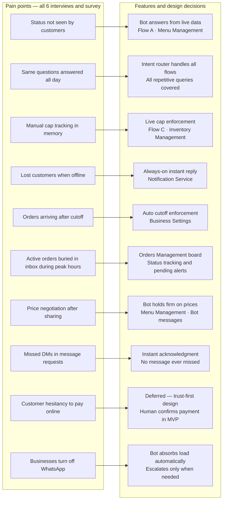

```mermaid
flowchart LR
    subgraph PROBLEMS["Pain points — all 6 interviews and survey"]
        P1[Status not seen by customers]
        P2[Same questions answered all day]
        P3[Manual cap tracking in memory]
        P4[Lost customers when offline]
        P5[Orders arriving after cutoff]
        P6[Active orders buried in inbox during peak hours]
        P7[Price negotiation after sharing]
        P8[Missed DMs in message requests]
        P9[Customer hesitancy to pay online]
        P10[Businesses turn off WhatsApp]
    end

    subgraph SOLUTIONS["Features and design decisions"]
        S1[Bot answers from live data\nFlow A · Menu Management]
        S2[Intent router handles all  flows\nAll repetitive queries covered]
        S3[Live cap enforcement\nFlow C · Inventory Management]
        S4[Always-on instant reply\nNotification Service]
        S5[Auto cutoff enforcement\nBusiness Settings]
        S6[Orders Management board\nStatus tracking and pending alerts]
        S7[Bot holds firm on prices\nMenu Management · Bot messages]
        S8[Instant acknowledgment\nNo message ever missed]
        S9[Deferred — trust-first design\nHuman confirms payment in MVP]
        S10[Bot absorbs load automatically\nEscalates only when needed]
    end

    P1 --> S1
    P2 --> S2
    P3 --> S3
    P4 --> S4
    P5 --> S5
    P6 --> S6
    P7 --> S7
    P8 --> S8
    P9 --> S9
    P10 --> S10
```
