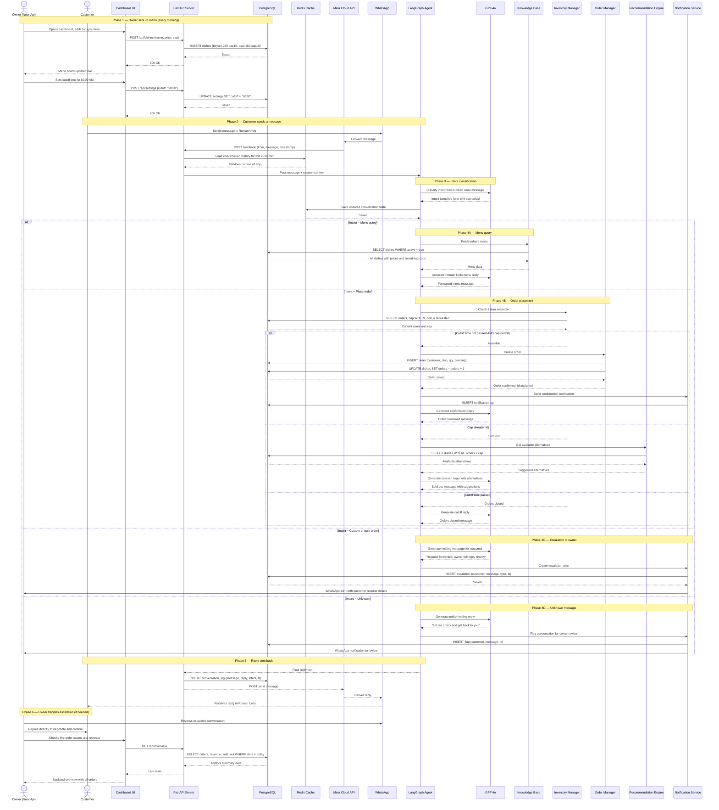

```mermaid
sequenceDiagram
    actor Owner as Owner (Noor Api)
    actor Customer
    participant Dashboard as Dashboard UI
    participant FastAPI as FastAPI Server
    participant DB as PostgreSQL
    participant Redis as Redis Cache
    participant API as Meta Cloud API
    participant WhatsApp as WhatsApp
    participant LangGraph as LangGraph Agent
    participant GPT as GPT-4o
    participant KB as Knowledge Base
    participant Inventory as Inventory Manager
    participant Orders as Order Manager
    participant Rec as Recommendation Engine
    participant Not as Notification Service

    %% ─────────────────────────────────────────
    %% PHASE 1: Owner sets up menu every morning
    %% ─────────────────────────────────────────
    Note over Owner, DB: Phase 1 — Owner sets up menu (every morning)

    Owner->>Dashboard: Opens dashboard, adds today's menu
    Dashboard->>FastAPI: POST /api/dishes {name, price, cap}
    FastAPI->>DB: INSERT dishes (biryani 250 cap15, daal 150 cap10)
    DB-->>FastAPI: Saved
    FastAPI-->>Dashboard: 200 OK
    Dashboard-->>Owner: Menu board updated live

    Owner->>Dashboard: Sets cutoff time to 10:00 AM
    Dashboard->>FastAPI: POST /api/settings {cutoff: "10:00"}
    FastAPI->>DB: UPDATE settings SET cutoff = "10:00"
    DB-->>FastAPI: Saved
    FastAPI-->>Dashboard: 200 OK

    %% ─────────────────────────────────────────
    %% PHASE 2: Customer sends a message
    %% ─────────────────────────────────────────
    Note over Customer, LangGraph: Phase 2 — Customer sends a message

    Customer->>WhatsApp: Sends message in Roman Urdu
    WhatsApp->>API: Forward message
    API->>FastAPI: POST /webhook {from, message, timestamp}
    FastAPI->>Redis: Load conversation history for this customer
    Redis-->>FastAPI: Previous context (if any)
    FastAPI->>LangGraph: Pass message + session context

    %% ─────────────────────────────────────────
    %% PHASE 3: Intent classification
    %% ─────────────────────────────────────────
    Note over LangGraph, GPT: Phase 3 — Intent classification

    LangGraph->>GPT: Classify intent from Roman Urdu message
    GPT-->>LangGraph: Intent identified (one of 9 scenarios)
    LangGraph->>Redis: Save updated conversation state
    Redis-->>LangGraph: Saved

    %% ─────────────────────────────────────────
    %% PHASE 4A: Menu query flow
    %% ─────────────────────────────────────────
    alt Intent = Menu query
        Note over LangGraph, KB: Phase 4A — Menu query
        LangGraph->>KB: Fetch today's menu
        KB->>DB: SELECT dishes WHERE active = true
        DB-->>KB: All dishes with prices and remaining caps
        KB-->>LangGraph: Menu data
        LangGraph->>GPT: Generate Roman Urdu menu reply
        GPT-->>LangGraph: Formatted menu message

    %% ─────────────────────────────────────────
    %% PHASE 4B: Order placement flow
    %% ─────────────────────────────────────────
    else Intent = Place order
        Note over LangGraph, Orders: Phase 4B — Order placement
        LangGraph->>Inventory: Check if item available
        Inventory->>DB: SELECT orders, cap WHERE dish = requested
        DB-->>Inventory: Current count and cap

        alt Cutoff time not passed AND cap not hit
            Inventory-->>LangGraph: Available
            LangGraph->>Orders: Create order
            Orders->>DB: INSERT order (customer, dish, qty, pending)
            Orders->>DB: UPDATE dishes SET orders = orders + 1
            DB-->>Orders: Order saved
            Orders-->>LangGraph: Order confirmed, id assigned
            LangGraph->>Not: Send confirmation notification
            Not->>DB: INSERT notification log
            LangGraph->>GPT: Generate confirmation reply
            GPT-->>LangGraph: Order confirmed message

        else Cap already hit
            Inventory-->>LangGraph: Sold out
            LangGraph->>Rec: Get available alternatives
            Rec->>DB: SELECT dishes WHERE orders < cap
            DB-->>Rec: Available alternatives
            Rec-->>LangGraph: Suggested alternatives
            LangGraph->>GPT: Generate sold-out reply with alternatives
            GPT-->>LangGraph: Sold-out message with suggestions

        else Cutoff time passed
            Inventory-->>LangGraph: Orders closed
            LangGraph->>GPT: Generate cutoff reply
            GPT-->>LangGraph: Orders closed message
        end

    %% ─────────────────────────────────────────
    %% PHASE 4C: Custom or bulk order escalation
    %% ─────────────────────────────────────────
    else Intent = Custom or bulk order
        Note over LangGraph, Not: Phase 4C — Escalation to owner
        LangGraph->>GPT: Generate holding message for customer
        GPT-->>LangGraph: "Request forwarded, owner will reply shortly"
        LangGraph->>Not: Create escalation alert
        Not->>DB: INSERT escalation (customer, message, type, ts)
        DB-->>Not: Saved
        Not->>Owner: WhatsApp alert with customer request details

    %% ─────────────────────────────────────────
    %% PHASE 4D: Unknown message escalation
    %% ─────────────────────────────────────────
    else Intent = Unknown
        Note over LangGraph, Not: Phase 4D — Unknown message
        LangGraph->>GPT: Generate polite holding reply
        GPT-->>LangGraph: "Let me check and get back to you"
        LangGraph->>Not: Flag conversation for owner review
        Not->>DB: INSERT flag (customer, message, ts)
        Not->>Owner: WhatsApp notification to review
    end

    %% ─────────────────────────────────────────
    %% PHASE 5: Reply sent back to customer
    %% ─────────────────────────────────────────
    Note over LangGraph, Customer: Phase 5 — Reply sent back

    LangGraph-->>FastAPI: Final reply text
    FastAPI->>DB: INSERT conversation_log (message, reply, intent, ts)
    FastAPI-->>API: POST send message
    API-->>WhatsApp: Deliver reply
    WhatsApp-->>Customer: Receives reply in Roman Urdu

    %% ─────────────────────────────────────────
    %% PHASE 6: Owner handles escalation directly
    %% ─────────────────────────────────────────
    Note over Owner, Customer: Phase 6 — Owner handles escalation (if needed)

    Owner->>WhatsApp: Reviews escalated conversation
    Owner->>Customer: Replies directly to negotiate and confirm
    Owner->>Dashboard: Checks live order counts and revenue
    Dashboard->>FastAPI: GET /api/overview
    FastAPI->>DB: SELECT orders, revenue, sold_out WHERE date = today
    DB-->>FastAPI: Today's summary data
    FastAPI-->>Dashboard: Live stats
    Dashboard-->>Owner: Updated overview with all orders
```
