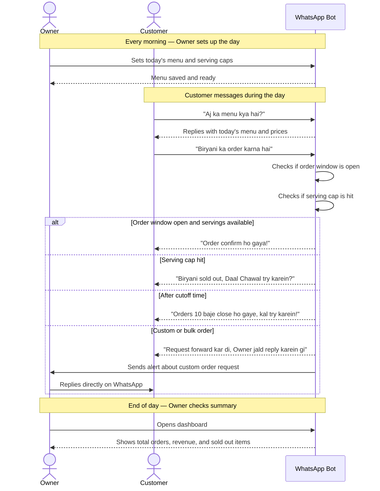

```mermaid
sequenceDiagram
    actor Owner
    actor Customer
    participant Bot as WhatsApp Bot

    Note over Owner, Bot: Every morning — Owner sets up the day

    Owner->>Bot: Sets today's menu and serving caps
    Bot-->>Owner: Menu saved and ready

    Note over Customer, Bot: Customer messages during the day

    Customer->>Bot: "Aj ka menu kya hai?"
    Bot-->>Customer: Replies with today's menu and prices

    Customer->>Bot: "Biryani ka order karna hai"
    Bot->>Bot: Checks if order window is open
    Bot->>Bot: Checks if serving cap is hit

    alt Order window open and servings available
        Bot-->>Customer: "Order confirm ho gaya!"

    else Serving cap hit
        Bot-->>Customer: "Biryani sold out, Daal Chawal try karein?"

    else After cutoff time
        Bot-->>Customer: "Orders 10 baje close ho gaye, kal try karein!"

    else Custom or bulk order
        Bot-->>Customer: "Request forward kar di, Owner jald reply karein gi"
        Bot->>Owner: Sends alert about custom order request
        Owner->>Customer: Replies directly on WhatsApp
    end

    Note over Owner, Bot: End of day — Owner checks summary

    Owner->>Bot: Opens dashboard
    Bot-->>Owner: Shows total orders, revenue, and sold out items
```
