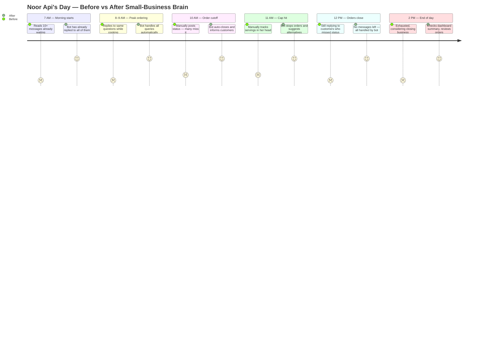

```mermaid
journey
    title Noor Api's Day — Before vs After Small-Business Brain

    section 7 AM — Morning starts
      Reads 10+ messages already waiting: 1: Before
      Bot has already replied to all of them: 5: After

    section 8–9 AM — Peak ordering
      Replies to same questions while cooking: 1: Before
      Bot handles all queries automatically: 5: After

    section 10 AM — Order cutoff
      Manually posts status — many miss it: 2: Before
      Bot auto-closes and informs customers: 5: After

    section 11 AM — Cap hit
      Manually tracks servings in her head: 2: Before
      Bot stops orders and suggests alternatives: 5: After

    section 12 PM — Orders close
      Still replying to customers who missed status: 1: Before
      No messages left — all handled by bot: 5: After

    section 2 PM — End of day
      Exhausted, considering closing business: 1: Before
      Checks dashboard summary, reviews orders: 5: After
```
